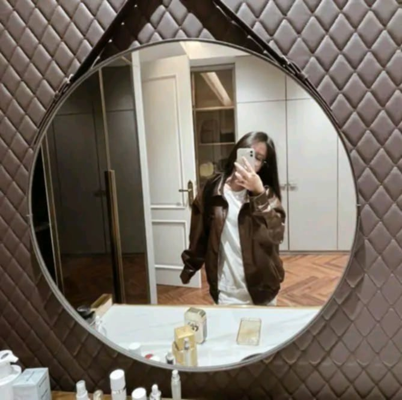
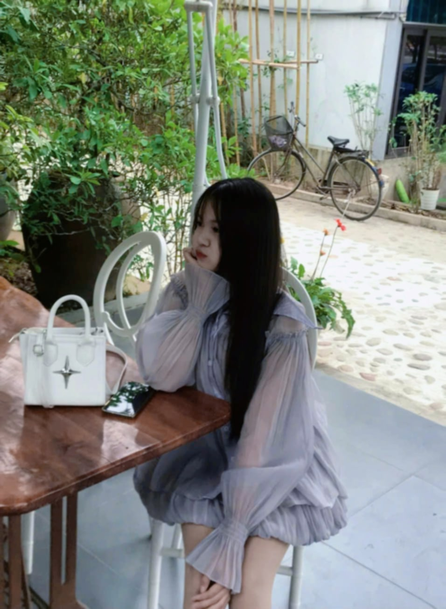

<html lang="vi">

<head>
    <meta charset="UTF-8">
    <meta name="viewport" content="width=device-width, initial-scale=1.0">
    <title>Thiệp 8/3</title>
    <link rel="stylesheet" href="https://cdnjs.cloudflare.com/ajax/libs/font-awesome/6.4.2/css/all.min.css">
    
</head>

<body>

    <button class="openButton" onclick="openLetter()">Chúc mừng 8/3</button>

    

        

            
            
            
            
            
            
            
            
        

        

            <i class="fa-solid fa-xmark closeButton" onclick="closeLetter()"></i>
            <h2>Gửi các cậu!</h2>
            
💖 Nhân dịp Quốc tế Phụ nữ 8/3, chúc các bạn nữ lớp 9A luôn vui vẻ, tự tin và ngày
                càng tỏa sáng. Cảm ơn các bạn vì đã luôn là một phần quan trọng của lớp mình! 💖...

        

    

    

</body>

</html>
